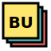

<div align="center">
  
  
  # Brutalist UI
  
  **A Neo-Brutalism styled React UI component library**
  
  Bold. Raw. Unapologetic.

[](https://www.npmjs.com/package/brutalist-ui)
[](https://www.npmjs.com/package/brutalist-ui)
[](https://opensource.org/licenses/MIT)
[](https://www.typescriptlang.org/)
[](https://reactjs.org/)

[](https://github.com/sponsors/dev-snake)
[](https://buymeacoffee.com/devsnake)

[Documentation](https://brutalist-ui.vercel.app) · [NPM Package](https://www.npmjs.com/package/brutalist-ui) · [Report Bug](https://github.com/dev-snake/brutalist-ui/issues)

</div>

---

<div align="center">
  
</div>

---

## 💖 Support This Project

If you find Brutalist UI useful, please consider supporting its development:

<a href="https://github.com/sponsors/dev-snake">
  
</a>
<a href="https://buymeacoffee.com/devsnake">
  
</a>
<a href="https://ko-fi.com/devsnake">
  
</a>

Your support helps keep this project alive and growing! 🚀

---

## ✨ Features

| Feature                     | Description                                      |
| --------------------------- | ------------------------------------------------ |
| 🎨 **Neo-Brutalism Design** | Bold 3px borders, offset shadows, vibrant colors |
| 🧱 **22+ Components**       | Comprehensive UI kit for modern applications     |
| 🌙 **Dark Mode**            | Full dark mode support out of the box            |
| ♿ **Accessible**           | Built on Radix UI primitives for A11y            |
| 📱 **Responsive**           | Mobile-first, responsive design                  |
| 🎯 **TypeScript**           | Full type safety and IntelliSense                |
| 🎨 **Tailwind CSS**         | Custom plugin with brutalism utilities           |
| ⚡ **Tree-shakeable**       | Import only what you need                        |

## 📦 Installation

```bash
# npm
npm install brutalist-ui

# pnpm
pnpm add brutalist-ui

# yarn
yarn add brutalist-ui
```

## 🚀 Quick Start

### 1. Configure Tailwind CSS

```js
// tailwind.config.js
module.exports = {
    content: [
        // ... your content paths
        './node_modules/brutalist-ui/**/*.{js,mjs}',
    ],
    darkMode: 'class',
    plugins: [require('brutalist-ui/brutalism-plugin')],
};
```

### 2. Import Styles (Optional)

```tsx
// In your app entry point
import 'brutalist-ui/styles.css';
```

### 3. Use Components

```tsx
import { Button, Card, CardHeader, CardContent, Badge } from 'brutalist-ui';

function App() {
    return (
        <Card>
            <CardHeader>
                <h2>Welcome to Brutalist UI</h2>
                <Badge variant="success">New</Badge>
            </CardHeader>
            <CardContent>
                <p>Bold, raw, and beautiful components.</p>
                <Button variant="primary" size="lg">
                    Get Started
                </Button>
            </CardContent>
        </Card>
    );
}
```

## 🧩 Components

### Layout & Containers

| Component   | Description                                     |
| ----------- | ----------------------------------------------- |
| `Card`      | Container with header, content, footer sections |
| `Separator` | Visual divider between content                  |

### Forms & Inputs

| Component  | Description                                              |
| ---------- | -------------------------------------------------------- |
| `Button`   | Primary, secondary, outline, ghost, destructive variants |
| `Input`    | Text input with brutalist styling                        |
| `Textarea` | Multi-line text input                                    |
| `Checkbox` | Toggle checkbox with checkmark                           |
| `Switch`   | Toggle switch control                                    |
| `Select`   | Dropdown select menu                                     |
| `Label`    | Form input labels                                        |

### Feedback & Status

| Component  | Description                                     |
| ---------- | ----------------------------------------------- |
| `Alert`    | Info, success, warning, error notifications     |
| `Badge`    | Status indicators and labels                    |
| `Toast`    | Toast notifications system                      |
| `Spinner`  | Loading spinners (brutalist, dots, pulse, bars) |
| `Skeleton` | Loading placeholder animations                  |

### Overlay & Popups

| Component      | Description                |
| -------------- | -------------------------- |
| `Dialog`       | Modal dialog windows       |
| `Popover`      | Floating content panels    |
| `Tooltip`      | Hover tooltips             |
| `DropdownMenu` | Context and dropdown menus |

### Navigation & Data

| Component    | Description                                |
| ------------ | ------------------------------------------ |
| `Tabs`       | Tabbed content navigation                  |
| `Table`      | Data tables with brutalist styling         |
| `Pagination` | Page navigation with first/last, prev/next |
| `Avatar`     | User avatars with fallback                 |

## 🎨 Tailwind Plugin Utilities

The brutalism plugin adds these utilities:

```css
.nb-border    /* 3px solid black border */
/* 3px solid black border */
/* 3px solid black border */
/* 3px solid black border */
.nb-shadow    /* 4px offset shadow */
.nb-shadow-sm /* 2px offset shadow */
.nb-shadow-lg /* 6px offset shadow */
.nb-press     /* Pressed state effect */
.nb-font; /* Bold 900 weight typography */
```

### Color Palette

| Color        | Hex       | Usage                        |
| ------------ | --------- | ---------------------------- |
| 🔴 Coral Red | `#FF6B6B` | Primary actions, destructive |
| 🟢 Teal      | `#4ECDC4` | Success, secondary           |
| 🟡 Yellow    | `#FFE66D` | Warning, highlights          |
| ⚫ Black     | `#000000` | Borders, text                |
| ⚪ White     | `#FFFFFF` | Backgrounds                  |

## 🏗️ Project Structure

```
brutalist-ui/
├── apps/
│   └── docs/              # Next.js 14 documentation site
│       ├── app/           # App router pages
│       ├── components/    # Doc site components
│       └── public/        # Static assets
├── packages/
│   └── ui/                # UI component library
│       ├── src/
│       │   ├── components/  # 22 React components
│       │   ├── lib/         # Utilities (cn, etc.)
│       │   └── brutalism-plugin.ts
│       └── dist/          # Built output
├── pnpm-workspace.yaml
└── package.json
```

## 🛠️ Development

```bash
# Clone the repository
git clone https://github.com/dev-snake/brutalist-ui.git
cd brutalist-ui

# Install dependencies
pnpm install

# Build the UI library
pnpm --filter brutalist-ui build

# Start docs dev server
pnpm --filter docs dev
```

### Scripts

| Command                            | Description               |
| ---------------------------------- | ------------------------- |
| `pnpm --filter brutalist-ui build` | Build the library         |
| `pnpm --filter brutalist-ui dev`   | Watch mode                |
| `pnpm --filter docs dev`           | Start docs server         |
| `pnpm --filter docs build`         | Build docs for production |

## 📄 License

MIT © [dev-snake](https://github.com/dev-snake)

---

## 🗺️ Roadmap

We're constantly improving Brutalist UI. Here's what's coming:

-   [x] ~~Core components (22+ components)~~
-   [x] ~~Dark mode support~~
-   [x] ~~TypeScript support~~
-   [x] ~~Tailwind CSS plugin~~
-   [ ] **More components**: DatePicker, DataTable, Drawer, Command Palette
-   [ ] **Animations**: Framer Motion integration
-   [ ] **Themes**: Multiple brutalist color themes
-   [ ] **Templates**: Dashboard, Landing page, Admin panel
-   [ ] **Figma Kit**: Design files for designers

### 💎 Pro Components (Coming Soon)

Premium components for serious projects:

| Component       | Description                                             | Status  |
| --------------- | ------------------------------------------------------- | ------- |
| DataTable Pro   | Advanced data table with sorting, filtering, pagination | 🔜 Soon |
| DatePicker      | Date & time picker with range selection                 | 🔜 Soon |
| Drawer          | Slide-out panel component                               | 🔜 Soon |
| Command Palette | Spotlight-style command menu                            | 🔜 Soon |
| Dashboard Kit   | Complete admin dashboard template                       | 🔜 Soon |

---

## 💖 Sponsors

<a href="https://github.com/sponsors/dev-snake">
  
</a>

Support the development of Brutalist UI and get your name/logo here!

---

<div align="center">
  <p>
    <strong>Made with 💛 and bold borders</strong>
  </p>
  <p>
    <a href="https://www.npmjs.com/package/brutalist-ui">NPM</a> •
    <a href="https://github.com/dev-snake/brutalist-ui">GitHub</a> •
    <a href="https://brutalist-ui.vercel.app">Docs</a>
  </p>
</div>
